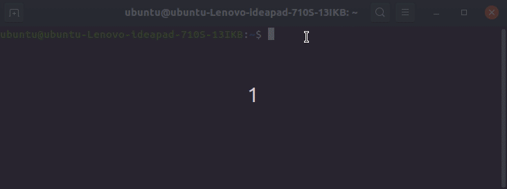

# serialEchoMD5
for arduino

使用了alistairuk的md5库 https://github.com/alistairuk/MD5_String

```
#include "MD5_String.h"
String incoming = "";
void setup() {
  Serial.begin(9600);
  Serial.println("hello");
}
void loop() { // run over and over
  if (Serial.available()) {
    //    Serial.write(Serial.read());
    incoming = Serial.readString();
    //Serial.println(incoming);
    String hash = md5_string(string2char(incoming));
    Serial.println(hash);
  }
}
char* string2char(String command) {
  if (command.length() != 0) {
    char *p = const_cast<char*>(command.c_str());
    return p;
  }
}
```

串口通讯，波特率9600，输入任意字符，返回md5。实际可能没什么用处，不过也许在特定应用场景下会有些用处。



(动图使用peek录制)
